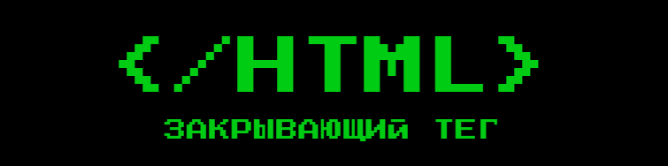
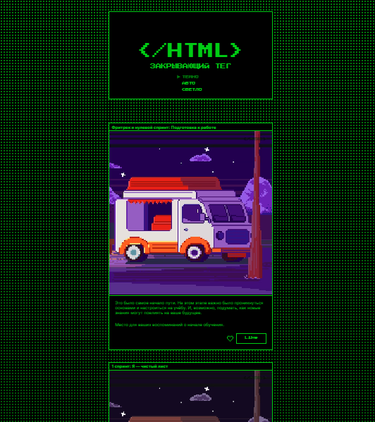
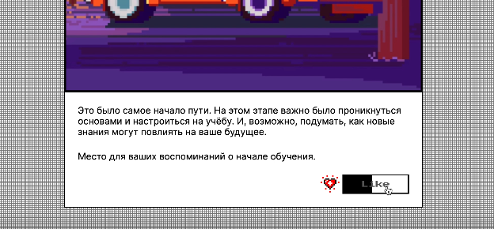
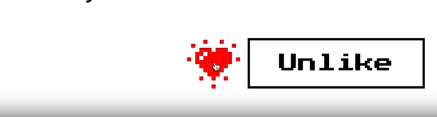
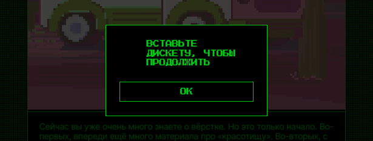

## 
  

## *Проект "Закрывающий тег": отработка навыков адаптивной верстки, трансформации и анимации.* 

### Проектные задачи:

- Выполнить адаптивную верстку (desktop, mobile).
- Подключить вариативные шрифты.
- Реализовать цветовые темы и их переключение.
- Добавить анимацию интерактивным элементам.

### Верстка
#### Страница. Темная тема
### 

### Анимации

- Около активного пункта меню стрелка постоянно движется вправо-влево.
- При фокусе c помощью клавиши Tab на кнопке меню происходит плавное подчёркивание слева направо.
- При наведении на кнопку лайка происходит плавное перекрытие кнопки контрастным цветом со сменой цветой текста.
### 

- При наведении мыши на сердце оно меняет цвет.
- При клике на сердце оно увеличивается в размерах, выбрасывает искры.
### 

### Функционал
- При нажатии на кнопку меню цветовая тема переключается на выбранную или соответствующую настройкам пользователя.
- При нажатии на кнопку или иконку лайка карточка отмечается закрашенным сердцем, если прежде лайк не был поставлен, либо контуром сердца, если лайк был поставлен ранее.
- При нажатии на кнопку сохранения появляется модальное окно с подтверждением.
### 

### *Stack: HTML, SCC( @media, @keyframes, flex, svg )*